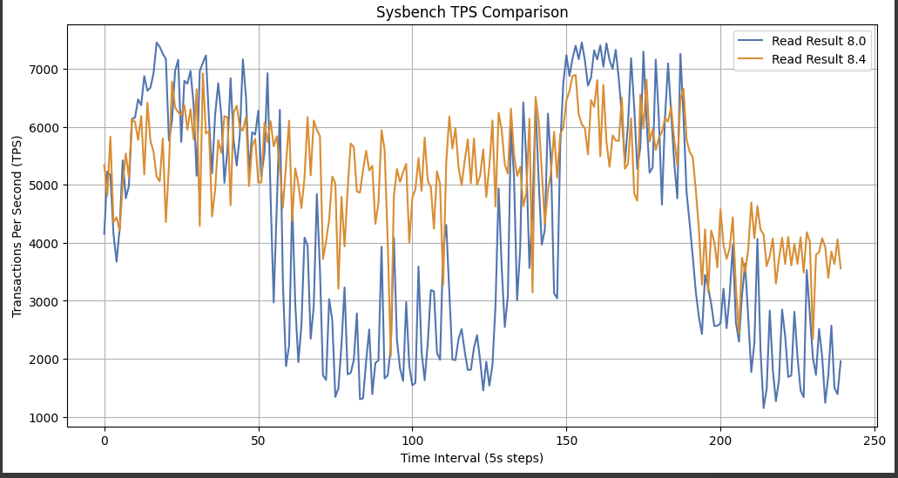
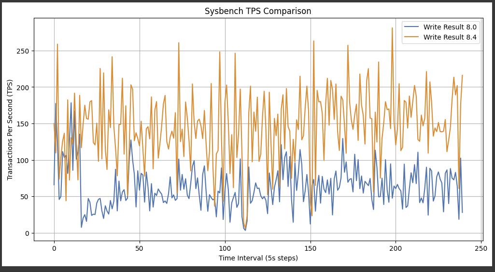

#### **Purpose**

This lab aims to analyze the performance differences between MySQL 8.0 and MySQL 8.4 due to the changes in the default values for `innodb_io_capacity` and `innodb_io_capacity_max`. The test environment will use **sysbench** to generate a high-write workload and simulate stress on the InnoDB flush mechanism with small redo log sizes and a high dirty page percentage.

---

### **Lab Steps**

#### **1. Setup Environment**

1. **Deploy PMM and MySQL Instances**:

   ```bash
   anydbver deploy pmm:2.42.0,docker-image,port=56287  
   anydbver deploy node1 ps:8.0 pmm-client:2.42.0-6,server=node0,mysql=node1 --keep
   anydbver deploy node2 ps:8.4 pmm-client:2.42.0-6,server=node0,mysql=node2 --keep
   ```

2. **Verify Deployment**:

   - Confirm that PMM and both MySQL instances are running:
     ```bash
     anydbver list
     ```
   - Access each MySQL instance:
     ```bash
     anydbver exec node1 mysql
     anydbver exec node2 mysql
     ```

3. **Configure Instances**:

   For both MySQL 8.0 and 8.4:
   - Set a small redo log size and low dirty page threshold:
     ```sql
     SET GLOBAL innodb_redo_log_capacity = 48 * 1024 * 1024; -- Small redo log
     SET GLOBAL innodb_max_dirty_pages_pct = 50; -- Start flushing when 50% dirty pages
     ```

   For MySQL 8.0 - We are about to test both version with the same defaults at 8.4
   - Set I/O Capacity and Maximum I/O Capacity:
     ```sql
    SET GLOBAL innodb_io_capacity_max = 20000; -- Set the maximum I/O capacity first
    SET GLOBAL innodb_io_capacity = 10000; -- Set the current I/O capacity
     ```

4. **Verify Configuration**:

   ```sql
   SHOW VARIABLES LIKE 'innodb_redo_log_capacity';
   SHOW VARIABLES LIKE 'innodb_max_dirty_pages_pct';
   SHOW VARIABLES LIKE 'innodb_io_capacity';
   SHOW VARIABLES LIKE 'innodb_io_capacity_max';
   ```

---

#### **2. Initialize Sysbench Tables**

**a. Create a User for Sysbench**

1. **Log in to MySQL**:

   For both MySQL 8.0 and 8.4:
   ```bash
   mysql -u root -p
   ```

2. **Create a Dedicated Sysbench User**:
   ```sql
   CREATE USER 'sbtest'@'127.0.0.1' IDENTIFIED BY 'sbtest_password';
   GRANT ALL PRIVILEGES ON sbtest.* TO 'sbtest'@'127.0.0.1';
   FLUSH PRIVILEGES;
   ```

**b. Initialize Sysbench Tables**

1. **Prepare the Database and Tables**:
   Run the following command to configure the sysbench workload:
   ```bash
   sysbench /usr/share/sysbench/oltp_write_only.lua \
       --mysql-host=127.0.0.1 \
       --mysql-port=3306 \
       --mysql-user=sbtest \
       --mysql-password=sbtest_password \
       --mysql-db=sbtest \
       --tables=10 \
       --table-size=100000 \
       prepare
   ```
   **Explanation**:
   - **`--mysql-host=127.0.0.1`**: Connects to the local MySQL instance.
   - **`--mysql-user=sbtest`**: Uses the sysbench user created above.
   - **`--mysql-password=sbtest_password`**: Password for the sysbench user.
   - **`--tables=10`**: Creates 10 tables in the `sbtest` database.
   - **`--table-size=100000`**: Inserts 100,000 rows per table.

---

#### **b. Run Sysbench Workload**

1. **Generate a High Insert Workload**:
   Run the following command to create a write-intensive workload:
   ```bash
    sysbench /usr/share/sysbench/oltp_write_only.lua \
        --mysql-host=127.0.0.1 \
        --mysql-port=3306 \
        --mysql-user=sbtest \
        --mysql-password=sbtest_password \
        --mysql-db=sbtest \
        --tables=10 \
        --table-size=100000 \
        --threads=16 \
        --time=1200 \
        --rate=0 \
        --skip-trx=off \
        --report-interval=5 \
        run | tee write_output.log &

    sysbench /usr/share/sysbench/oltp_read_only.lua \
        --mysql-host=127.0.0.1 \
        --mysql-port=3306 \
        --mysql-user=sbtest \
        --mysql-password=sbtest_password \
        --mysql-db=sbtest \
        --tables=10 \
        --table-size=100000 \
        --threads=16 \
        --time=1200 \
        --rate=0 \
        --skip-trx=off \
        --report-interval=5 \
        run | tee read_output.log &
   ```

   **Explanation**:
   - **`--threads=16`**: Simulates 16 concurrent threads for the workload.
   - **`--time=300`**: Runs the workload for 5 minutes.
   - **`--rate=0`**: Unlimited transaction rate.
   - **`--skip-trx=off`**: Ensures transactions are enabled.
   - **`--report-interval=5`**: Outputs a progress report every 5 seconds.

---

#### **3. Results**





---


